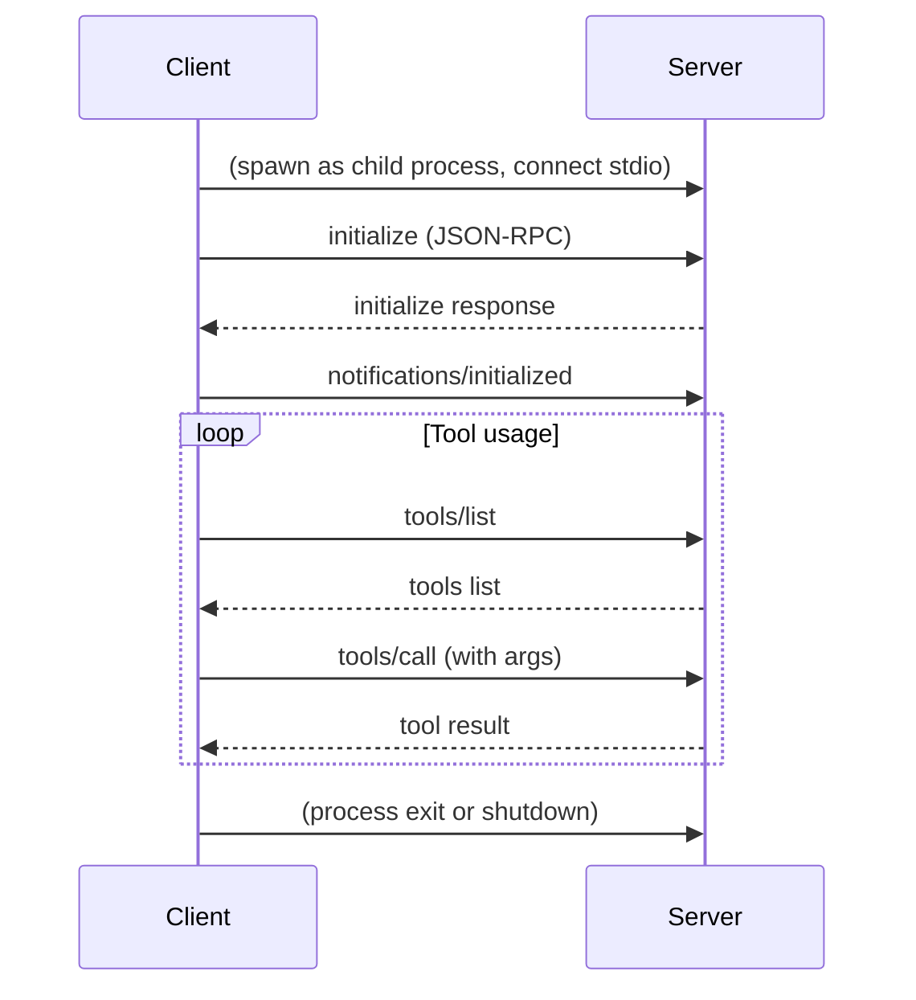
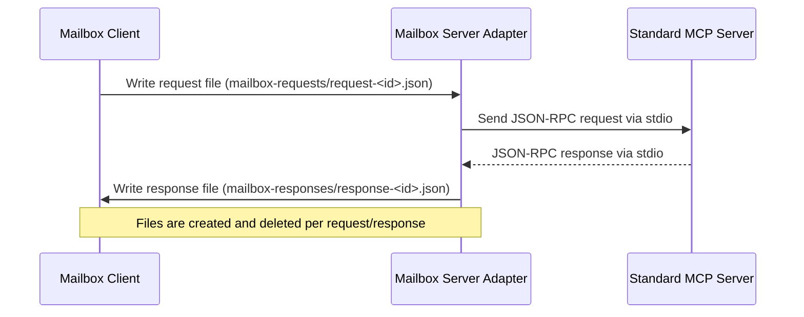
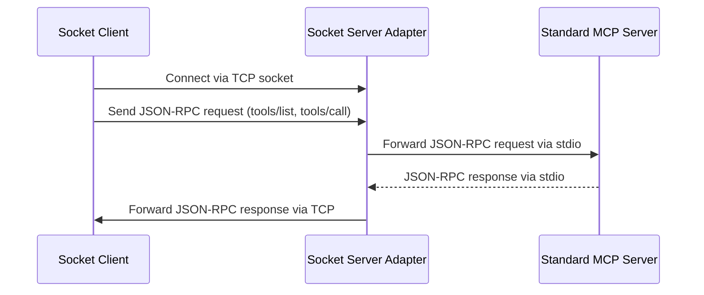

# MCP Client-Server Communication (Model Context Protocol)

This repository demonstrates **how a Model Context Protocol (MCP) client communicates with an MCP server** using a simple, general-purpose protocol: [JSON-RPC 2.0](https://www.jsonrpc.org/specification) over standard input/output (stdio), TCP sockets, or mailbox (file-based) adapters.

## Project Purpose

- **Showcase the general communication flow** between an MCP client and server.
- **Demonstrate JSON-RPC over stdio, TCP sockets, and mailbox (file-based) adapters** for tool discovery and invocation.
- **Serve as a reference implementation** for building custom MCP clients or servers in any language.

## How It Works (General Protocol)

- The **client** launches or connects to the MCP server using one of several transport mechanisms (stdio, TCP socket, or mailbox).
- All communication uses the **JSON-RPC 2.0** protocol, with each message as a single line of JSON.
- The client and server exchange requests and responses for initialization, tool discovery, and tool invocation.

### General Flow

1. **Process Launch & Connection**
   - The client starts the server as a child process (stdio), connects via TCP socket, or communicates via mailbox files.
2. **JSON-RPC Message Exchange**
   - All communication is via JSON-RPC 2.0 messages, one per line.
3. **Initialization**
   - Client sends an `initialize` request.
   - Server responds with capabilities.
   - Client sends an `initialized` notification.
4. **Tool Discovery and Invocation**
   - Client requests a list of available tools (`tools/list`).
   - Server responds with tool metadata.
   - Client invokes a tool (`tools/call`) with arguments.
   - Server executes the tool and responds with the result.
5. **Result Handling & Loop**
   - The client receives results and may repeat tool calls as needed.
6. **Shutdown**
   - The client can terminate the server process (or send a shutdown message, if supported).

## Communication Sequence Diagram (Standard)



## Mailbox (File-based) Flow (with Adapter)

The mailbox experiment now uses an **adapter** that bridges mailbox requests to the standard server via stdio. The adapter reads request files, forwards them to the standard server, and writes response files back.



## Socket (TCP) Flow (with Adapter)

The socket mode uses a TCP server adapter that bridges socket requests to the standard server via stdio. The socket client connects to this adapter and communicates using JSON-RPC over TCP.



## Example JSON-RPC Message

**Request:**

```json
{
  "jsonrpc": "2.0",
  "id": 1,
  "method": "tools/call",
  "params": {
    "name": "greet",
    "arguments": { "name": "Alice" }
  }
}
```

**Response:**

```json
{
  "jsonrpc": "2.0",
  "id": 1,
  "result": {
    "content": [{ "type": "text", "text": "Hello, Alice!" }]
  }
}
```

## Project Structure

- `src/mcp/standard/` — Standard (stdio-based) MCP client and interactive runner
- `src/mcp/socket/` — Socket (TCP-based) MCP client, interactive runner, and server adapter (bridges to standard server)
- `src/mcp/mailbox/` — Mailbox (file-based) MCP client, interactive runner, and **adapter** (bridges to standard server)
- `src/server/` — Example MCP server implementation

## Unified Client Interface

All MCP clients (`MCPClient`, `SocketMCPClient`, `MailboxMCPClient`) implement a common `IMCPClient` interface, providing a consistent API for connecting, listing tools, calling tools, and closing the connection. This makes it easy to swap between different transport mechanisms in your code.

## Try It Out

### Standard (stdio-based) mode

```bash
bun install
bun run standard
```

### Socket (TCP-based) experiment

- Start the socket server adapter:

  ```bash
  bun run socket:server
  ```

- In another terminal, start the socket client:

  ```bash
  bun run socket:client
  ```

  Or run the interactive socket client directly:

  ```bash
  bun run src/mcp/socket/interactive-socket.ts
  ```

### Mailbox (file-based) experiment

This repo also includes an **experimental mailbox-based flow** where the client and server communicate by writing/reading files in mailbox directories. The mailbox server is now an adapter that bridges requests to the standard server via stdio.

- Start the mailbox server adapter:

  ```bash
  bun run mailbox:server
  ```

- In another terminal, start the mailbox client:

  ```bash
  bun run mailbox:client
  ```

---

**This repo is a reference for building and understanding MCP client-server communication over stdio, TCP sockets, or mailbox files using JSON-RPC, and includes adapters for bridging protocols.**
