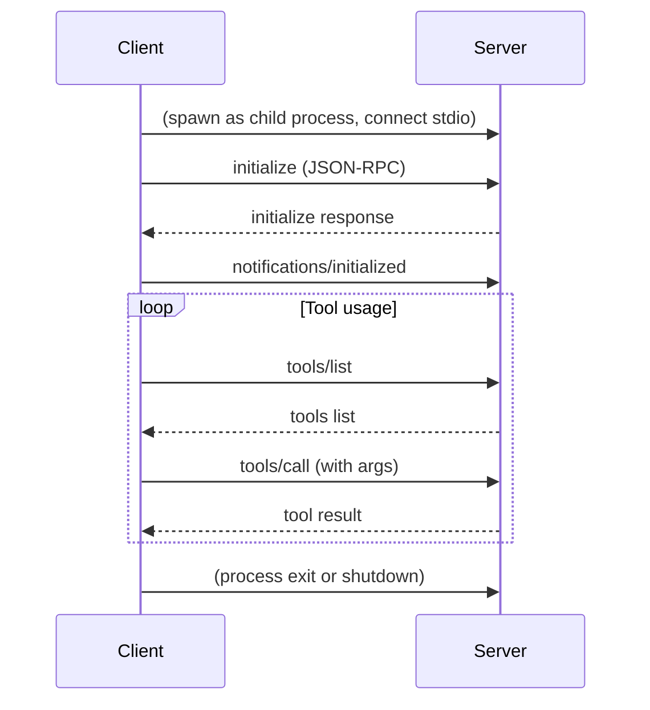

# MCP Client-Server Communication (Model Context Protocol)

This repository demonstrates **how a Model Context Protocol (MCP) client communicates with an MCP server** using a simple, general-purpose protocol: [JSON-RPC 2.0](https://www.jsonrpc.org/specification) over standard input/output (stdio).

## Project Purpose

- **Showcase the general communication flow** between an MCP client and server.
- **Demonstrate JSON-RPC over stdio** for tool discovery and invocation.
- **Serve as a reference implementation** for building custom MCP clients or servers in any language.

## How It Works (General Protocol)

- The **client** launches the MCP server as a child process and connects via stdio (pipes).
- All communication uses the **JSON-RPC 2.0** protocol, with each message as a single line of JSON.
- The client and server exchange requests and responses for initialization, tool discovery, and tool invocation.

### General Flow

1. **Process Launch & Stdio Wiring**

   - The client starts the server as a child process.
   - The client's `stdin`/`stdout` are connected to the server's `stdout`/`stdin`.

2. **JSON-RPC Message Exchange**

   - All communication is via JSON-RPC 2.0 messages, one per line.

3. **Initialization**

   - Client sends an `initialize` request.
   - Server responds with capabilities.
   - Client sends an `initialized` notification.

4. **Tool Discovery and Invocation**

   - Client requests a list of available tools (`tools/list`).
   - Server responds with tool metadata.
   - Client invokes a tool (`tools/call`) with arguments.
   - Server executes the tool and responds with the result.

5. **Result Handling & Loop**

   - The client receives results and may repeat tool calls as needed.

6. **Shutdown**
   - The client can terminate the server process (or send a shutdown message, if supported).

## Communication Sequence Diagram



## Example JSON-RPC Message

**Request:**

```json
{
  "jsonrpc": "2.0",
  "id": 1,
  "method": "tools/call",
  "params": {
    "name": "greet",
    "arguments": { "name": "Alice" }
  }
}
```

**Response:**

```json
{
  "jsonrpc": "2.0",
  "id": 1,
  "result": {
    "content": [{ "type": "text", "text": "Hello, Alice!" }]
  }
}
```

## Project Structure

- `src/impl/mcp-client.ts` — Core MCP client implementation (handles JSON-RPC, stdio, request/response)
- `src/interactive.ts` — Example interactive CLI runner (user interface)
- `src/server/` — Example MCP server implementation

## Try It Out

```bash
bun install
bun run src/interactive.ts bun run src/server
```

---

**This repo is a reference for building and understanding MCP client-server communication over stdio using JSON-RPC.**
